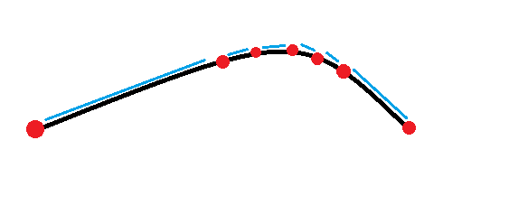
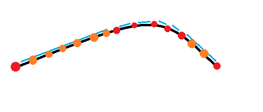
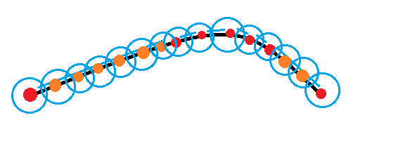

## Geofencing API
The geofencing API is a NodeJs + Redis REST API designed to monitor persons during a planned trip and check if the predefined route and all its aspects are respected and if something happens it will inform supervisors about these issues in real time.

The API needs a list of persons to monitor alongside with route details for each one and optionally a list of supervisors for each person.

The API is able to detect and inform in real time using the push notification system the following events:
- If the person doesn't respect the predefined route and goes off the specified road.
- If the person stays too much in the same location.
- When a person reaches a specific location that was set in the route configuration.
- When a person doesn't reach a specific location at a specific time which was set in the route configuration.
- When a person reaches a specific location earlier than a specific time set in the route configuration and by how much earlier.
- When a person reaches a specific location later than a specific time set in the route configuration and by how much later.
- When a person initiates a new geofence session
- When a person reaches the destination

The api comes with a large list of configurable variables for each person like controlling what notifications to be triggered, specific messages for each event with support for multiple languages or  parameters for geofence accuracy, also it will return valuable information during the geofence session which can be used for tracking history, reports or in app custom notification system.

## How to run / use the API.

For production run the following commands in docker-compose-prod/hgf:
- ``docker-compose up --build -d``

For development run the following commands in docker-compose-dev/hgf-dev:
- ``docker-compose up --build -d && docker exec -it hgf-dev-express sh -c "npm run start:docker:dev"``

This can also be used without docker compose, just run a NodeJs image and tile38 image.

In NodeJs container install Typescript and pm2 globally and then run in the root folder :

```
npm install
npm run tsc
pm2 start ecosystem.config.js
```

Put the right tileHost for tile38 server in config-development.ts / config-production.ts file in src folder.

**Note!**

Using compose with Docker will automatically set containers to restart on any server restart and, also the pm2 processes will run automatically.
Using standalone images will require extra setup for this functionality.

## Generating Predefined Route
Tile38 is used as a helper to detect if a certain position is in a certain area or more areas intersect one with each other.

This tool supports only areas, radius areas, square areas etc.

To be able to make use of tile38, this API takes linear coordinates and process them.

Linear coordinates are composed of successive inline geographical positions defined by latitude and longitude which can be connected with a straight line.



Processing coordinates means to generate multiple points between each 2 consecutive points because the distance between points in the initial set of values is not equal.

Now the distance between each 2 points can be set with `fenceAreaBetweenPointsMeters` param in config file, and the result would look like this:



**Note!**

If the distance between already existing  2 points is equal or less than the values of `fenceAreaBetweenPointsMeters`, they will be skipped.

In the end the tool adds a radius area for each point, and the area value is defined by `fenceAreaBorderMeters`.



**Note!**

All the generated points are at an equal distance, and the radius is the same (pictures are only for a visual demo, not 100% accurate).

**Note!**

The distance between points can't be set higher than half of the radius value because each point radius must intersect with each nearby point radius. 

Now the tool will compare current position of the target against each point in the predefined road and this is how detection is done.

## Endpoints
### Initiate a geofence session

```http 
POST /target [Content-Type application/json; charset=utf-8]
```

#### Request body / params example

```json
{
  "id": 1,
  "fence": {
    "area": [[44.415652, 26.107377], [44.415668, 26.107641], [44.415683, 26.107921], [44.415706, 26.108339]],
    "customAreas": [
      {
        "name": "Custom area 1",
        "position": [44.415668, 26.107641]
      }
    ],
    "timetableCustomAreas": [
      {
        "name": "Timetable area 1",
        "position": [44.416578, 26.124091],
        "time": 1598793400000,
        "error": 1
      }
    ]
  },
  "customConfig": {
    "timeTableErrorMinutes": 55,
    "offFenceAreaNotificationIntervalMinutes": 55,
    "fenceNearbyRetry": 5,
    "fenceAreaBorderMeters": 60,
    "fenceAreaBetweenPointsMeters": 30,
    "customAreaRadiusMeters": 35,
    "notifyMessageLanguage": "en",
    "targetName": "Target 1",
    "sameLocationTime": 1,
    "notifyFenceStartedStatus" : false,
    "notifyReachedDestinationStatus" : false,
    "notifyLateArrivalStatus" : false,
    "notifyEarlyArrivalStatus" : false,
    "notifySameLocationStatus": false
  },
  "isFencingOn": true
}
```
These are all the possible params

**All params types are defined in `/src/models` directory**

`isFencingOn : required`
- This defines if there is a current geofence session or not.
- If this is set to true, all the required parameters must be passed to the request.
- If this is set to false, no other parameter is needed.
- Once this is set to true, another request with different parameters won't work, it must be set to false and then again to true in order to be able to modify any parameter.
- When a session is stopped that means the `isFenncingOn` param is set to false, the API will reset all the geofence params which are used in the geofence process except for the `supervisor push tokens`, `target supervisor list` and `target custom config parameters` which are persistent.

`id : required , unique`
- Defines the target id, it must be unique otherwise all the data associated with it will be overwritten on a new entry for the same id.

`fance.area : required` 
- Define the route for the target.

`fence.customAreas : optional` 
- A list of CustomArea objects.
- If this param is defined, the tool will watch if the target reached any of this area of interest and will return a proper response and send a notification if the notification module config is set.

`fence.customArea.name : optional` 
- A name for a specific area e.g. a subway station, if not set the notification message will include the coordinates instead to define the area name.

`fence.customArea.position : required if customArea is defined`
- Represents the Latitude Longitude position of the custom area.

`fence.timetableCustomAreas : optional`
- A list of TimetableCustomArea.
- This is like a custom area, but it also defines an approximate arrival time, and a time error, which may trigger a notification if the target didn't reach the area around the specified time + time error.

`fence.timetableCustomAreas.name : optoinal`
- A name for the specific area e.g. a bus station name. If not set, the notification message will include the coordinates instead to define the area name.

`fence.timetableCustomAreas.position : required if timetableCustomArea is defined`
- Represents the Latitude Longitude position of the area.

`fence.timetableCustomAreas.time : required if timetableCustomArea is defined`
- Represents the arrival time, this means that target should reach the area around the specified time otherwise the API will detect this and fire a notification.

`fence.timetableCustomAreas.error : optional`
- Represents the time error which is by default defined in the api config. For example if we set the arrival time at 10:00 AM and error to 5 minutes that means the target should reach the area between 10:00 and 10:05 AM.
- If this is not defined the default `timeTableErrorMinutes` from the API config will be used.

`customConfig : optional`
- Represent a list of all the configurable parameters that influence the way the geofence is done.
- All the parameters here are optional as they are already defined in the API default config.
- They can be set 1 at a time or multiple at a time and, also they can be changed during a geofence session. (there is another route to change them).

`customConfig.timeTableErrorMinutes : optional`
- Represents the time error in minutes for TimetableCustomArea. This value is used in geofence process if a timetable custom area didn't define a time error.

`customConfig.offFenceAreaNotificationIntervalMinutes : optional`
- Represents how often offFenceArea notifications can be sent. For example if we set this to 3 minutes, when a target goes outside the route the notifications will be sent from 3 to 3 minutes.

`customconfig.fenceNearbyRetry : optional`
- Represents the consecutive number of times that the API will check if the user is out of the predefined route. 
- This exists because sometime devices can send bad data which are not real, so we have to somehow overcome teh possibility to fire irrelevant notifications.

`customConfig.fenceAreaBorderMeters : optional`
- Represents the radius value for each point in the generated route.

`customConfig.fenceAreaBetweenPointsMeters : optional`
- Represents the distance between each 2 consecutive points set on route processing.

`customConfig.customAreaRadiusMeters : optional`
- Represents the `customArea / timetableCustomArea` radius value.

`notifyMessageLanguage: optional`
- Represents the language for notification messages.
- Messages can be defined in  `notify-messages.ts` and there should be at least 1 value for the default language or the set language.

`customConfig.targetName : optional`
- Represents an alias for the target otherwise the target id is gonna be used in messaging system.

`customConfig.sameLocationTime : optional`
- Represents the time in minutes for same location check.
- If a target stays more than the specified time in the same spot, a notification will be sent.

`customConfig.notifyFenceStartedStatus`
- Determines if a notification should be sent when a new geofence session starts.

`customConfig.notifyReachedDestinationStatus`
- Determines if a notification should be sent when the target reached the destination.

`customConfig.notifyLateArrivalStatus`
- Determines if a notification should be sent when a target reached a `timetableCustomArea` later

`customConfig.notifyEarlyArrivalStatus`
- Determines if a notification should be sent when a target reached a `timetableCustomArea` earlier

`customConfig.notifySameLocationStatus`
- Determines if a notification should be sent when a target stays more than specified time in the same spot.

#### Success responses

Code 200

##### If `isFencingOn` is `true`

```json
{
    "message": "Session status updated",
    "data": {
        "sessionStatus": true,
        "notifyFenceStarted": false,
        "notifyMessage": ""
    },
    "ok": true
}
```
`notifyFenceStarted`  `notifyMessage` depend on the `notifyFenceStartedStatus` value, if true then valid info is returned otherwise `null | ""` is returned.

##### If `isFencingOn` is `false`

```json
{
    "message": "Session status updated",
    "data": {
        "sessionStatus": false
    },
    "ok": true
}
```

#### Error responses

Code 400 : bad request

```json
{
    "ok": false,
    "error": "A fencing session is already on for this target, please stop current session and start a new one in order to update it",
    "data": {},
    "stack": "Error: A fencing session is already on for this target, please stop current session and start a new one in order to update it at Object.validatePostTargetParams (/var/www/data/src/validators/target.ts:75:15) at processTicksAndRejections (internal/process/task_queues.js:97:5) at /var/www/data/src/controller/target.ts:51:5 at /var/www/data/src/core/handle-http.ts:31:13"
}
```

`error`  `data`  `stack` values depend on the fail reason.

### Update target position

```http 
PUT /target [Content-Type application/json; charset=utf-8]
```
#### Request body / params example

```json
{
    "id":1,
    "position": [44.415668, 26.107641]
}
```

`id : required`
- Represents target id

`position : required`
- Represents target current position

### Success response

Code : 200

```json
{
    "message": "Target updated",
    "data": {
        "checkFenceAreaResult": {
            "notifyReachedDestination": false,
            "notifyOutOfFence": false,
            "reachedDestination": false,
            "notifyMessage": ""
        },
        "checkCustomAreasResult": {
            "customArea": null,
            "notifyReachedCustomArea": false,
            "notifyMessage": ""
        },
        "checkTimetableCustomAreasResult": {
            "currentTime": 0,
            "timetableCustomArea": null,
            "notifyLateArrival": false,
            "notifyNoArrival": false,
            "notifyEarlyArrival": false,
            "notifyMessage": ""
        },
        "checkSameLocation": {
            "notifySameLocation": false,
            "notifyMessage": ""
        }
    },
    "ok": true
}
```

- All properties in the response may differ if an event occurs.
- If any of notify property has value that means an event occurred and possibly a notification was triggered. These data can be used for reports purpose or in app notification.
- If a certain notification is not turned on in `customConfig` or no event occurred, the values for notify properties will be `null / false / 0 / ""`.
- `reachedDestination` will be set to true when target reaches the destination but this won't trigger a notification if `reachedDestination` is `false`.
- `timetableCustomArea` is the time specified in the timetableCustom area.
- `timetableCustomArea` represents the current time.
- all times are in unix timestamp.

### Error response

Code 400 : bad request

```json
{
    "ok": false,
    "error": "position is required and must be array of [Latitude, Longitude]",
    "data": {},
    "stack": "Error: position is required and must be array of [Latitude, Longitude] at Object.validatePutTargetParams (/var/www/data/src/validators/target.ts:42:15) at processTicksAndRejections (internal/process/task_queues.js:97:5) at /var/www/data/src/controller/target.ts:99:5 at /var/www/data/src/core/handle-http.ts:31:13"
}
```
`error`  `data`  `stack` values depend on the fail reason.

### Update target custom config

```http 
PUT /target/custom-config [Content-Type application/json; charset=utf-8]
```
#### Request body / params example

```json
{
  "id": 1,
  "customConfig": {
    "timeTableErrorMinutes": 55,
    "offFenceAreaNotificationIntervalMinutes": 55,
    "fenceNearbyRetry": 5,
    "fenceAreaBorderMeters": 60,
    "fenceAreaBetweenPointsMeters": 30,
    "customAreaRadiusMeters": 35,
    "notifyMessageLanguage": "en",
    "targetName": "Target Dadu 1",
    "sameLocationTime": 1,
    "notifyFenceStartedStatus": false,
    "notifyReachedDestinationStatus": false,
    "notifyLateArrivalStatus": false,
    "notifyEarlyArrivalStatus": false,
    "notifySameLocationStatus": false
  }
}
```
All the properties in customConfig are explained above.

`id : required`
- Represents the target id.

### Success response

Status 200

```json
{
    "message": "Target custom config updated!",
    "data": {},
    "ok": true
}
```

### Error response

Status 400 : Bad request

```json
{
    "ok": false,
    "error": "notifyLateArrivalStatus must be a boolean",
    "data": {},
    "stack": "Error: notifyLateArrivalStatus must be a boolean at /var/www/data/src/validators/target.ts:188:61 at Array.forEach (<anonymous>) at Object.validateCustomConfig (/var/www/data/src/validators/target.ts:178:29) at /var/www/data/src/controller/target.ts:118:5 at /var/www/data/src/core/handle-http.ts:31:19 at Layer.handle [as handle_request] (/var/www/data/node_modules/express/lib/router/layer.js:95:5) at next (/var/www/data/node_modules/express/lib/router/route.js:137:13) at Route.dispatch (/var/www/data/node_modules/express/lib/router/route.js:112:3) at Layer.handle [as handle_request] (/var/www/data/node_modules/express/lib/router/layer.js:95:5) at /var/www/data/node_modules/express/lib/router/index.js:281:22"
}
```

`error`  `data`  `stack` values depend on the fail reason.


### Update target list of supervisors / Add supervisor

```http 
PUT /target/supervisor [Content-Type application/json; charset=utf-8]
```
#### Request body / params example

```json
{
    "targetId": 1,
    "supervisorId": 1
}
```
`targetId : required`
- Represents the target id.

`supervisorId : required`
- Represents the supervisor id.

### Success response

Status 200

```json
{
    "message": "Supervisor added to target",
    "data": {},
    "ok": true
}
```

### Error response

Status 400 : Bad request

```json
{
    "ok": false,
    "error": "This supervisor does not exist",
    "data": {
        "supervisorId": 1
    },
    "stack": "Error: This supervisor does not exist at Object.validatePutDeleteSupervisorParams (/var/www/data/src/validators/target.ts:61:32) at processTicksAndRejections (internal/process/task_queues.js:97:5) at /var/www/data/src/controller/target.ts:129:5 at /var/www/data/src/core/handle-http.ts:31:13"
}
```

`error`  `data`  `stack` values depend on the fail reason.


### Update target list of supervisors / Remove supervisor

```http 
DELETE /target/supervisor [Content-Type application/json; charset=utf-8]
```
#### Request body / params example

```json
{
    "targetId": 1,
    "supervisorId": 1
}
```
`targetId : required`
- Represents the target id.

`supervisorId : required`
- Represents the supervisor id.

**!Note**
Removing a supervisor from a user will still keep the supervisor credentials in database.

### Success response

Status 200

```json
{
    "message": "Supervisor removed from target",
    "data": {},
    "ok": true
}
```

### Error response

Status 400 : Bad request

```json
{
    "ok": false,
    "error": "supervisorId is required and must be string or number",
    "data": {},
    "stack": "Error: supervisorId is required and must be string or number at Object.validatePutDeleteSupervisorParams (/var/www/data/src/validators/target.ts:57:15) at /var/www/data/src/controller/target.ts:139:11 at /var/www/data/src/core/handle-http.ts:31:19 at Layer.handle [as handle_request] (/var/www/data/node_modules/express/lib/router/layer.js:95:5) at next (/var/www/data/node_modules/express/lib/router/route.js:137:13) at Route.dispatch (/var/www/data/node_modules/express/lib/router/route.js:112:3) at Layer.handle [as handle_request] (/var/www/data/node_modules/express/lib/router/layer.js:95:5) at /var/www/data/node_modules/express/lib/router/index.js:281:22 at Function.process_params (/var/www/data/node_modules/express/lib/router/index.js:335:12) at next (/var/www/data/node_modules/express/lib/router/index.js:275:10)"
}
```

`error`  `data`  `stack` values depend on the fail reason.

### Add supervisor

```http 
POST /supervisor [Content-Type application/json; charset=utf-8]
```
#### Request body / params example

```json

```

### Success response

Status 200

```json
{
    "message": "Supervisor added!",
    "data": {},
    "ok": true
}
```

### Error response

Status 400 : Bad request

```json
{
    "ok": false,
    "error": "supervisorId is required and must be string or number",
    "data": {},
    "stack": "Error: supervisorId is required and must be string or number at Object.validatePutDeleteSupervisorParams (/var/www/data/src/validators/target.ts:57:15) at /var/www/data/src/controller/target.ts:139:11 at /var/www/data/src/core/handle-http.ts:31:19 at Layer.handle [as handle_request] (/var/www/data/node_modules/express/lib/router/layer.js:95:5) at next (/var/www/data/node_modules/express/lib/router/route.js:137:13) at Route.dispatch (/var/www/data/node_modules/express/lib/router/route.js:112:3) at Layer.handle [as handle_request] (/var/www/data/node_modules/express/lib/router/layer.js:95:5) at /var/www/data/node_modules/express/lib/router/index.js:281:22 at Function.process_params (/var/www/data/node_modules/express/lib/router/index.js:335:12) at next (/var/www/data/node_modules/express/lib/router/index.js:275:10)"
}
```

`error`  `data`  `stack` values depend on the fail reason.

### Get push system related errors

```http 
GET /push-errors/:date
```

#### Examples

```
curl -X GET http://localhost:8000/push-errors/all
curl -X GET http://localhost:8000/push-errors/11-8-2020
curl -X GET http://localhost:8000/push-errors/1-7-2020
```

**!Note**

Push notification module is async and the logs will be stored in files.
Files are named like this : `day-month-year.txt` and the day and month will have 1 digit if < 10.

#### Placeholders

```
:date 
```
- This placeholder can be the file name which is the day date in format `day-month-year.txt` or `all`.
- If the placeholder is the file name then only file's content will be returned.
- If the placeholder is `all` then all the files content will be returned.

### Success response

Status 200

Will contain array of objects | array of array of objects | empty array.

### Error response

Status 404 : not found

```json
{ 
  "message": "File not found",
   "result": []
 }
```